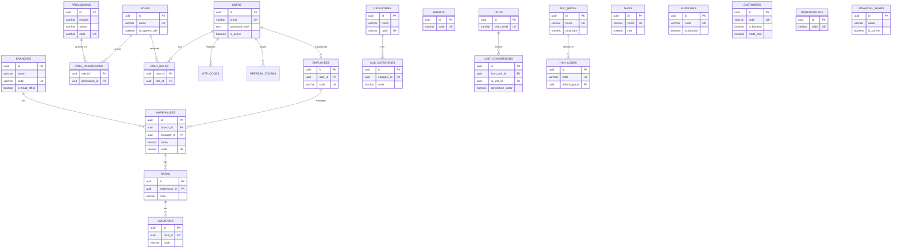

# ER Diagram — Master / Org (tenant schema)

Org hierarchy, RBAC, and catalog/trading-partner masters. Every table here lives inside each
tenant's own schema (cloned from `tenant_template`).

```mermaid
erDiagram
    BRANCHES ||--o{ WAREHOUSES : has
    WAREHOUSES ||--o{ RACKS : has
    RACKS ||--o{ LOCATIONS : has
    EMPLOYEES ||--o{ WAREHOUSES : manages

    ROLES ||--o{ ROLE_PERMISSIONS : grants
    PERMISSIONS ||--o{ ROLE_PERMISSIONS : "granted via"
    USERS ||--o{ USER_ROLES : has
    ROLES ||--o{ USER_ROLES : assigned
    USERS ||--o{ OTP_CODES : requests
    USERS ||--o{ REFRESH_TOKENS : issues
    USERS ||--o| EMPLOYEES : "is (optional)"

    CATEGORIES ||--o{ SUB_CATEGORIES : has

    BRANCHES {
        uuid id PK
        varchar name
        varchar code UK
        boolean is_head_office
    }
    WAREHOUSES {
        uuid id PK
        uuid branch_id FK
        uuid manager_id FK
        varchar name
        varchar code UK
    }
    RACKS {
        uuid id PK
        uuid warehouse_id FK
        varchar code
    }
    LOCATIONS {
        uuid id PK
        uuid rack_id FK
        varchar code
    }
    ROLES {
        uuid id PK
        varchar name UK
        boolean is_system_role
    }
    PERMISSIONS {
        uuid id PK
        varchar module
        varchar action
        varchar code UK
    }
    ROLE_PERMISSIONS {
        uuid role_id FK
        uuid permission_id FK
    }
    USERS {
        uuid id PK
        varchar email UK
        text password_hash
        boolean is_active
    }
    USER_ROLES {
        uuid user_id FK
        uuid role_id FK
    }
    EMPLOYEES {
        uuid id PK
        uuid user_id FK
        varchar code UK
    }
    CATEGORIES {
        uuid id PK
        varchar name
        varchar code UK
    }
    SUB_CATEGORIES {
        uuid id PK
        uuid category_id FK
        varchar code
    }
    BRANDS {
        uuid id PK
        varchar code UK
    }
    UNITS {
        uuid id PK
        varchar short_code UK
    }
    UNIT_CONVERSIONS {
        uuid id PK
        uuid from_unit_id FK
        uuid to_unit_id FK
        numeric conversion_factor
    }
    GST_RATES {
        uuid id PK
        varchar name UK
        numeric total_rate
    }
    HSN_CODES {
        uuid id PK
        varchar code UK
        uuid default_gst_id FK
    }
    TAXES {
        uuid id PK
        varchar name UK
        numeric rate
    }
    SUPPLIERS {
        uuid id PK
        varchar code UK
        boolean is_blocked
    }
    CUSTOMERS {
        uuid id PK
        varchar code UK
        boolean is_blocked
        numeric credit_limit
    }
    TRANSPORTERS {
        uuid id PK
        varchar code UK
    }
    FINANCIAL_YEARS {
        uuid id PK
        varchar name
        boolean is_current
    }

    UNITS ||--o{ UNIT_CONVERSIONS : "from/to"
    GST_RATES ||--o{ HSN_CODES : "default for"
```
