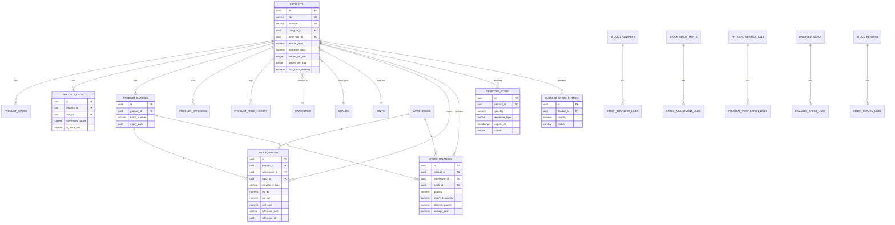

# ER Diagram — Product & Inventory (tenant schema)

`stock_ledger` is the append-only source of truth; `stock_balances` is the maintained
summary every screen actually reads from (see `functions/002_stock_functions.sql`).

