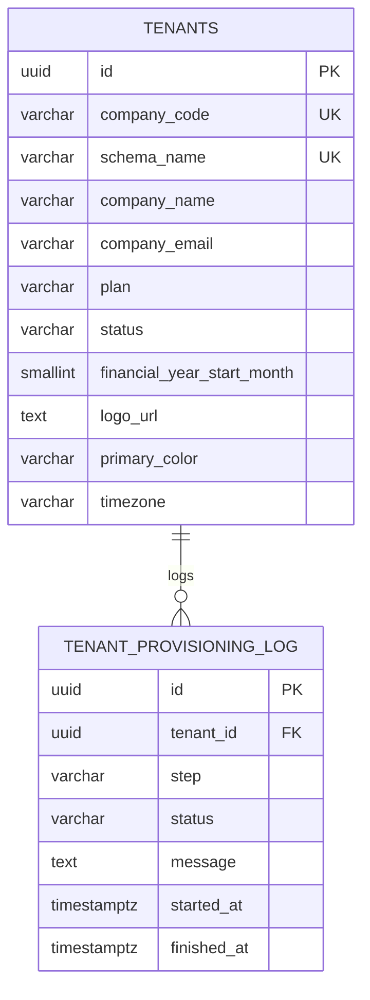

# ER Diagram — `public` schema (tenant directory)

Lives outside every tenant schema. One row per company; resolves login/company_code to the
tenant's Postgres schema.

```mermaid
erDiagram
    TENANTS ||--o{ TENANT_PROVISIONING_LOG : logs

    TENANTS {
        uuid id PK
        varchar company_code UK
        varchar schema_name UK
        varchar company_name
        varchar company_email
        varchar plan
        varchar status
        smallint financial_year_start_month
        text logo_url
        varchar primary_color
        varchar timezone
    }

    TENANT_PROVISIONING_LOG {
        uuid id PK
        uuid tenant_id FK
        varchar step
        varchar status
        text message
        timestamptz started_at
        timestamptz finished_at
    }
```
