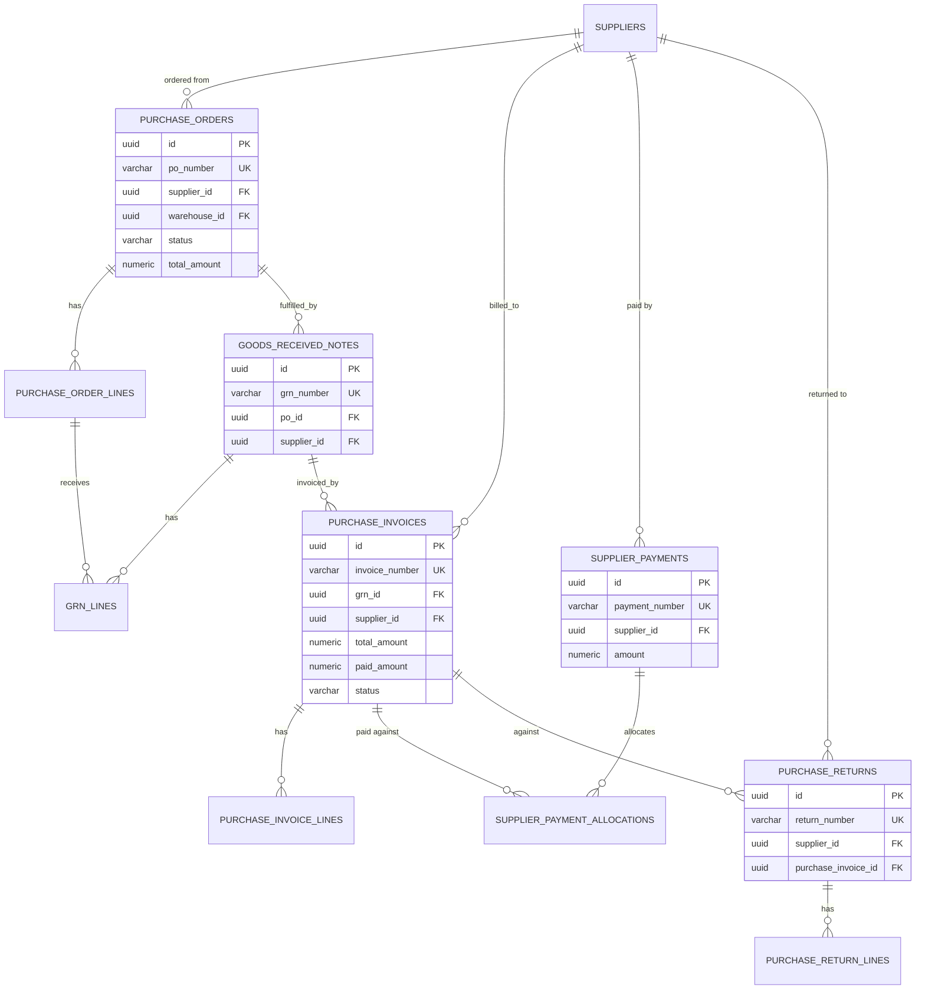

# ER Diagram — Purchase cycle (tenant schema)

`Purchase Order -> Goods Received Note -> Purchase Invoice -> Supplier Payment`, plus
Purchase Return. Same header/line + document-number pattern used everywhere.

