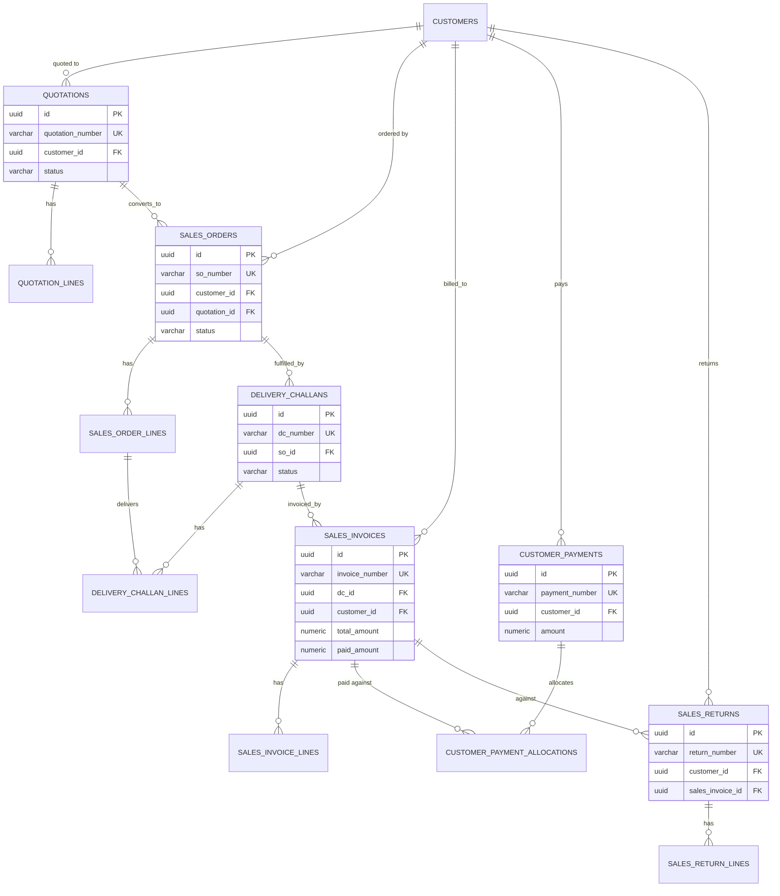

# ER Diagram — Sales cycle (tenant schema)

`Quotation -> Sales Order -> Delivery Challan -> Sales Invoice -> Customer Payment`,
plus Sales Return. Mirrors the purchase cycle exactly.

```mermaid
erDiagram
    CUSTOMERS ||--o{ QUOTATIONS : "quoted to"
    QUOTATIONS ||--o{ QUOTATION_LINES : has
    QUOTATIONS ||--o{ SALES_ORDERS : converts_to
    CUSTOMERS ||--o{ SALES_ORDERS : "ordered by"
    SALES_ORDERS ||--o{ SALES_ORDER_LINES : has
    SALES_ORDERS ||--o{ DELIVERY_CHALLANS : fulfilled_by
    SALES_ORDER_LINES ||--o{ DELIVERY_CHALLAN_LINES : delivers
    DELIVERY_CHALLANS ||--o{ DELIVERY_CHALLAN_LINES : has
    DELIVERY_CHALLANS ||--o{ SALES_INVOICES : invoiced_by
    CUSTOMERS ||--o{ SALES_INVOICES : billed_to
    SALES_INVOICES ||--o{ SALES_INVOICE_LINES : has
    CUSTOMERS ||--o{ CUSTOMER_PAYMENTS : pays
    CUSTOMER_PAYMENTS ||--o{ CUSTOMER_PAYMENT_ALLOCATIONS : allocates
    SALES_INVOICES ||--o{ CUSTOMER_PAYMENT_ALLOCATIONS : "paid against"
    CUSTOMERS ||--o{ SALES_RETURNS : returns
    SALES_INVOICES ||--o{ SALES_RETURNS : "against"
    SALES_RETURNS ||--o{ SALES_RETURN_LINES : has

    QUOTATIONS {
        uuid id PK
        varchar quotation_number UK
        uuid customer_id FK
        varchar status
    }
    SALES_ORDERS {
        uuid id PK
        varchar so_number UK
        uuid customer_id FK
        uuid quotation_id FK
        varchar status
    }
    DELIVERY_CHALLANS {
        uuid id PK
        varchar dc_number UK
        uuid so_id FK
        varchar status
    }
    SALES_INVOICES {
        uuid id PK
        varchar invoice_number UK
        uuid dc_id FK
        uuid customer_id FK
        numeric total_amount
        numeric paid_amount
    }
    CUSTOMER_PAYMENTS {
        uuid id PK
        varchar payment_number UK
        uuid customer_id FK
        numeric amount
    }
    SALES_RETURNS {
        uuid id PK
        varchar return_number UK
        uuid customer_id FK
        uuid sales_invoice_id FK
    }
```
