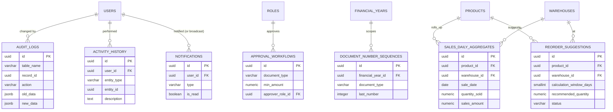

# ER Diagram — System & AI/Reporting support (tenant schema)

Audit trail, notifications, approval config, document numbering, and the tables backing the
heuristic AI forecasting engine.

```mermaid
erDiagram
    USERS ||--o{ AUDIT_LOGS : "changed by"
    USERS ||--o{ ACTIVITY_HISTORY : performed
    USERS ||--o{ NOTIFICATIONS : "notified (or broadcast)"
    ROLES ||--o{ APPROVAL_WORKFLOWS : approves
    FINANCIAL_YEARS ||--o{ DOCUMENT_NUMBER_SEQUENCES : scopes

    PRODUCTS ||--o{ SALES_DAILY_AGGREGATES : rolls_up
    WAREHOUSES ||--o{ SALES_DAILY_AGGREGATES : at
    PRODUCTS ||--o{ REORDER_SUGGESTIONS : suggests
    WAREHOUSES ||--o{ REORDER_SUGGESTIONS : at

    AUDIT_LOGS {
        uuid id PK
        varchar table_name
        uuid record_id
        varchar action
        jsonb old_data
        jsonb new_data
    }
    ACTIVITY_HISTORY {
        uuid id PK
        uuid user_id FK
        varchar entity_type
        uuid entity_id
        text description
    }
    NOTIFICATIONS {
        uuid id PK
        uuid user_id FK
        varchar type
        boolean is_read
    }
    APPROVAL_WORKFLOWS {
        uuid id PK
        varchar document_type
        numeric min_amount
        uuid approver_role_id FK
    }
    DOCUMENT_NUMBER_SEQUENCES {
        uuid id PK
        uuid financial_year_id FK
        varchar document_type
        integer last_number
    }
    SALES_DAILY_AGGREGATES {
        uuid id PK
        uuid product_id FK
        uuid warehouse_id FK
        date sale_date
        numeric quantity_sold
        numeric sales_amount
    }
    REORDER_SUGGESTIONS {
        uuid id PK
        uuid product_id FK
        uuid warehouse_id FK
        smallint calculation_window_days
        numeric recommended_quantity
        varchar status
    }
```
